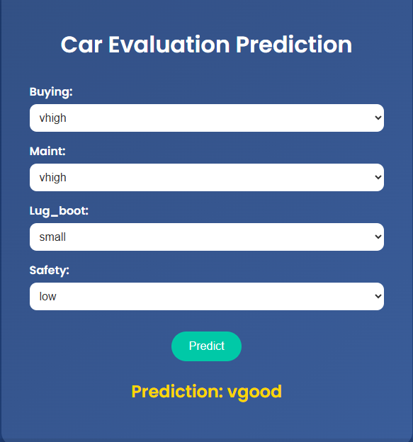

# Car Evaluation App




## 📂 Contents

- **01_Preprocessing.py**  
  Data cleaning and preprocessing steps.
- **02_unsupervised_clustering_and_validation.py**  
  Unsupervised clustering and validation analysis.
- **03_feature_selection.py**  
  Feature selection process for optimal model inputs.
- **04_Imbalance_Learning.py**  
  Methods to handle class imbalance.
- **05_supervised_classifiers.py**  
  Implementation of supervised classification algorithms.
- **06_Classifier_Performance_Visualization.py**  
  Visualization of classifier performance metrics.
- **07_car_webapp.py**  
  Flask web app for car evaluation prediction.
- **index.html**  
  Frontend for the car evaluation web app.

### 📊 Datasets

- **car_evaluation.csv** – Original dataset.
- **car_evaluation_balanced.csv** – Balanced class dataset.
- **car_evaluation_encoded.csv** – Encoded features for ML models.
- **car_evaluation_selected(_Reduced).csv** – Feature-selected/reduced datasets.

---

## 🚗 Project Overview

This project applies various machine learning and data science techniques to the Car Evaluation dataset, including preprocessing, feature selection, handling imbalanced data, model training, evaluation, and deployment via a web application.

---

## 🚀 Getting Started

1. **Install requirements:**  
   ```bash
   pip install flask numpy pandas scikit-learn joblib
   ```
2. **Run the web app:**  
   ```bash
   python 07_car_webapp.py
   ```
   Then open your browser at [http://localhost:5000](http://localhost:5000)

3. **Explore the Notebooks/Scripts:**  
   - Each script is numbered to guide you through the workflow from preprocessing to deployment.

---

## 🌟 Example Prediction

- Visit the web app.
- Input car features.
- Get instant evaluation using the trained model.


---

## 🤝 Contributing

Feel free to fork, raise issues, or submit pull requests for improvements!


